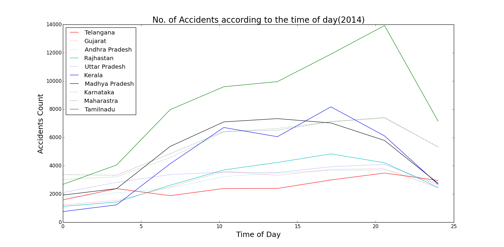

```{r setup, include=FALSE}
knitr::opts_chunk$set(echo = TRUE)
#source("DataProjectR.R")
```

#Road Accidents in India

India is the second largest country in terms of population and there is no shock that there are millions of cars cruising through the road every minute. This project uses the data set of number of accidents that happened in 2014, split in a three hour window of the dy, in the entire year for all states in India. 

Given below is a heat map of accidents count in 2014 as the time of day progresses.


To get a more clear idea, here is a line plot of the top 10 states with the most number of accidents. 


